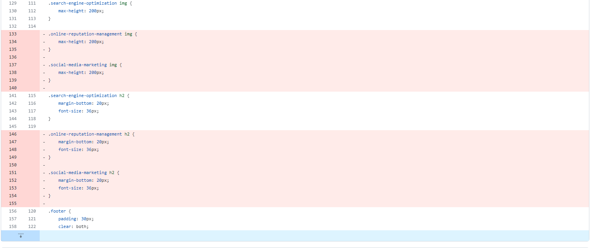

# Bootcamp Challenge 01

## Description

In this bootcamp challenge, the main goal was to perform a "on-the-job ticket", which means a starter code is already given and I have to modify it in order
to improve the code. I am working on this project to enhance my refactoring skills, which means that I need to consolidate and improve the code without changing what it already does. This project taught me to be have a better understanding of being able to detect redundancy within codes, and to consolidate and clean when such a 
scenario presents itself.

## Installation

N/A

## Usage

This code will be improved from its' previous given starter version. After reviewing the code and searching for ways to improve it, I noticed numerous cases where there was a lot of redundancy that needed to be consolidated. For example, as shown on the image below, the code "max-height-200px;" is being called out three times by three different classes. Therefore, to save some space and consolidate the code, I removed the ones highlighted in red and only called out the one highlighted in white on the html code.

Also, here is a screenshot of the website being deployed and a link to it!

LINK:

## Credits

GA Tech bootcamp challenge 01 starter code

## License

MIT License
